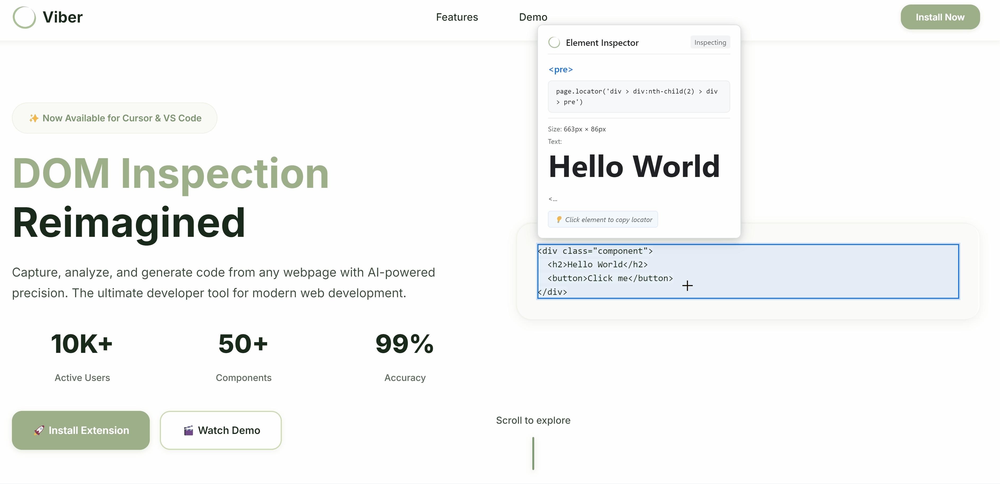

<p align="center">
  
</p>

<h1 align="center">Viber 🔍</h1>

<p align="center">
  <strong>Interactive DOM inspection and AI-powered code generation extension for Cursor IDE and VS Code</strong>
</p>

<p align="center">
  <a href="https://github.com/zhijiewong/viber/releases"></a>
  <a href="LICENSE"></a>
  <a href="https://code.visualstudio.com/"></a>
  <a href="https://nodejs.org/"></a>
</p>

<p align="center">
  Capture any webpage's DOM structure, inspect elements interactively, and generate production-ready code components with AI assistance.
</p>

<p align="center">
  
</p>

<p align="center">
  <em>This project aims to provide developers and vibe coders with an intuitive way to extract DOM elements from websites they're developing, helping them easily locate where they want AI to program in order to complete projects efficiently. Future updates will include one-click integration with Cursor and other AI programming tools for seamless workflow enhancement.</em>
</p>

## ✨ Features

- **🌐 DOM Inspection**: Capture and analyze any webpage's DOM structure in real-time
- **🎯 Interactive Selection**: Click-to-select elements with visual highlighting
- **🤖 AI Code Generation**: Generate React, Vue, Angular, and vanilla JS components
- **📋 Multi-format Export**: Copy selectors, XPath, JSON, or HTML data
- **🔧 Dev Server Detection**: Auto-detect and inspect local development servers
- **🎨 Cursor Integration**: Seamless integration with Cursor's native AI

## 🚀 Quick Start

### Prerequisites
- **VS Code** or **Cursor IDE** 1.73.0+
- **Node.js** 18+
- **Git**

### Installation

#### From Marketplace (Coming Soon)
Search for "Viber" in VS Code Extensions

#### Development Setup
```bash
git clone https://github.com/zhijiewong/viber.git
cd viber
npm install
npm run compile-dev
# Press F5 in VS Code to launch
```

## 📖 Usage

### Basic Workflow
1. **Open Command Palette** (`Ctrl+Shift+P`)
2. **Run** `Viber: Open URL in Viber`
3. **Enter URL** or run `Viber: Detect Local Dev Server`
4. **Click elements** to inspect and generate code

### Commands
- `Viber: Open URL` - Capture webpage DOM
- `Viber: Detect Local Dev Server` - Find dev servers
- `Viber: Generate Code from Selection` - Generate components

### Configuration
```json
{
  "viber.defaultBrowser": "chromium",
  "viber.aiProvider": "cursor-native",
  "viber.autoDetectDevServer": true
}
```

## 🏗️ Architecture

**Built with modern web technologies:**
- **Playwright** - Browser automation
- **TypeScript** - Type safety
- **VS Code API** - Extension framework
- **Floating UI** - Advanced positioning

## ⚙️ Configuration

**Browser Options:** `chromium`, `firefox`, `webkit`  
**AI Providers:** `cursor-native`, `openai`, `anthropic`  
**Settings:** Use `viber.*` instead of `domAgent.*` in your VS Code settings

## 🧪 Development

```bash
npm install          # Install dependencies
npm run watch        # Development with auto-rebuild
npm run compile      # Production build
npm test            # Run tests
npm run lint        # Code linting
```

**Tech Stack:** ESLint, Prettier, TypeScript, Jest, Playwright

## 📈 Roadmap

- ✅ **Phase 1**: Core extension architecture
- 🚧 **Phase 2**: Advanced DOM analysis features
- 📋 **Phase 3**: Enhanced UI and responsiveness
- 🤖 **Phase 4**: AI integration improvements
- 🎨 **Phase 5**: Production polish and marketplace

## 🤝 Contributing

We welcome contributions! See our [Contributing Guide](CONTRIBUTING.md) for details.

## 📚 Documentation

- [📖 **User Guide**](docs/user-guide.md) - Complete usage instructions
- [📋 **Changelog**](CHANGELOG.md) - Version history

## 🐛 Troubleshooting

### Common Issues

**Extension won't load:**
- Ensure VS Code/Cursor is version 1.73.0 or higher
- Check Node.js version (18+ required)
- Try reloading the window (`Ctrl+Shift+P` → "Developer: Reload Window")
- Check that you're using the new `viber.*` commands instead of `dom-agent.*`

**DOM capture fails:**
- Verify the URL is accessible
- Check browser permissions and security settings
- Ensure Playwright browsers are installed

**AI code generation not working:**
- Verify Cursor AI is enabled and configured
- Check API keys for alternative AI providers
- Ensure internet connectivity

### Getting Help

- 📧 **Email**: support@dom-agent.dev
- 🐛 **Issues**: [GitHub Issues](https://github.com/your-username/dom-agent/issues)
- 💬 **Discussions**: [GitHub Discussions](https://github.com/your-username/dom-agent/discussions)
- 📖 **Documentation**: [Full Documentation](https://dom-agent.dev/docs)

## 📄 License

Licensed under [Apache License 2.0](LICENSE).

## 📞 Support

- 🐛 [Issues](https://github.com/your-username/viber/issues)
- 💬 [Discussions](https://github.com/your-username/viber/discussions)
- 📧 contact@viber.dev

---

<p align="center">
  <strong>Built with ❤️ for the developer community</strong><br>
  <em>Empowering developers with AI-assisted web development tools</em>
</p>